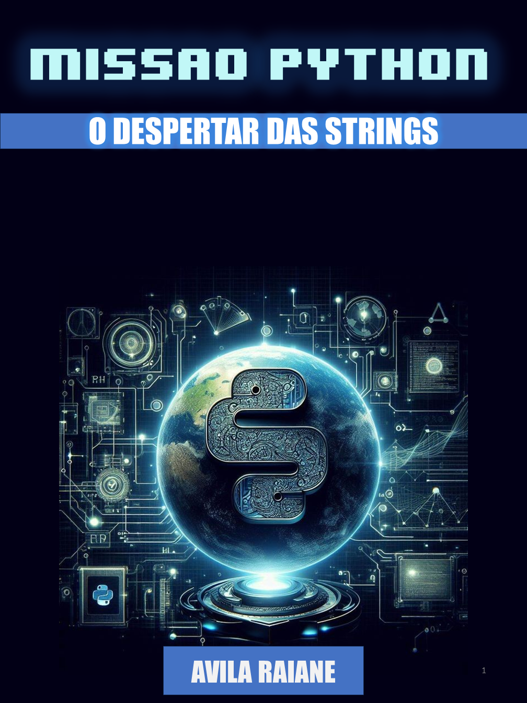

    

-------

# Projeto EBOOK Gerado por I.A.s

 > ℹ️ **NOTE:** Este é o repositório desenvolvido durante o curso Santander 2024 - Fundamentos de IA para Devs na plataforma da [DIO](https://dio.me)

Projeto com o objetivo de gerar um ebook digital com as facilidades das ferramentas de IA. todos os prompts
seguem abaixo.

<a href="https://github.com/avilaraiane/prompts-chatGPT-to-create-a-ebook/blob/main/output/ebook%20-%20python.pdf" title="View PDF now"> 📕Clique aqui para ler</a>

## 💻 Tecnologias utilizadas no projeto

- [ChatGPT](https://chat.openai.com/) 
- [MidJourney](https://www.midjourney.com/app/)
- [PowerPoint](https://www.microsoft.com/en/microsoft-365/powerpoint)

## 🧠 Prompts

ChatGPT：

|   Ação   | prompt                                                                                                                                                                                                                                                                               |
| :------: | ------------------------------------------------------------------------------------------------------------------------------------------------------------------------------------------------------------------------------------------------------------------------------------ |
|  título  | crie um titulo de um ebook sobre o tema métodos de string, o ebook é do nicho de proramação e o subnicho é de python, o título deve ser epico e curto , e tenha uma tematica de futurista, me liste 5 exemplos de titulos                                                            |
| conteúdo | faça um texto para ebook, com foco em strings,listando os principais MÉTODOS DE STRING com exemplos em código (REGRAS) Explique sempre de uma maneira simples, Deixe o texto enxuto, Sempre traga exemplos de código em contextos reais, Sempre deixe um título sugestivo por tópico |

Midjourney：

|  Ação  | prompt                                                                                                 |
| :----: | ------------------------------------------------------------------------------------------------------ |
| título | image of planet earth with the python logo in the center with a technological and futuristic appearance|

## ✨ Features

- Conteúdo gerado via ChatGPT
- Imagens geradas via MidJourney

## 📚 Materiais

- Imagens utilizadas em `assets`
- ebook gerado durante as aulas em `output`

## 🛠️ Instruções de execução

Utilize os prompts acima nas ferramentas sugeridas para gerar o material base e utilize uma ferramenta de edição de documentos como power point, libreoffice , indesign para diagramação.

-------

